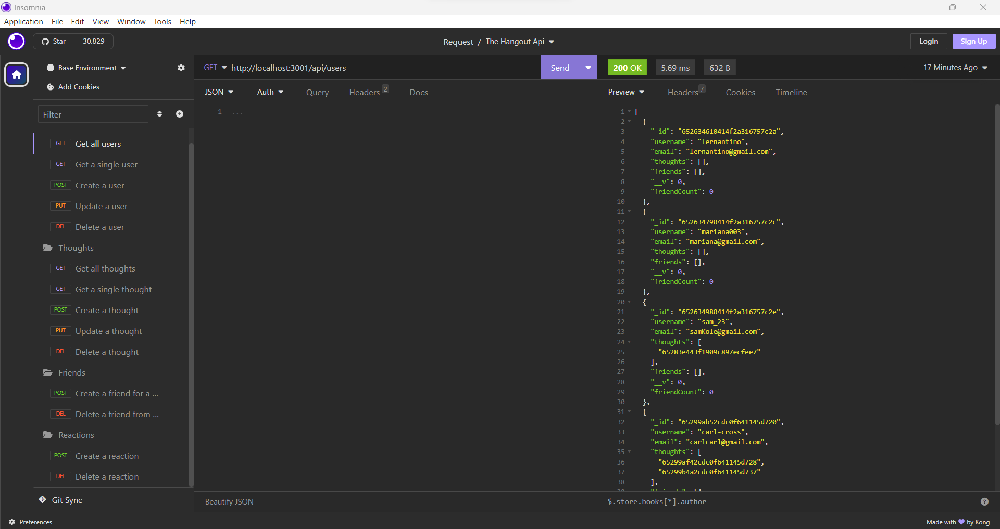

# The-Hangout-Api
## Description
This data generator, called Hangout Api, is a server where users create their profiles and share thoughts. Each user can make connections and friends as well as leave reactions to thoughts of any other users. It is a social place where anyone can explore and develop long-lasting relationships.

[Go to Video Here](https://drive.google.com/file/d/1mZlYbOtKXnuEVV_6TGd_jNR-bp-Qouua/view)

## Installation
It all started with creating a repo in GitHub. After I made the folders for each section as well as the files. Then it was just a matter of creating my ideas to make it all work.

## Usage
To use the program, a user needs to create a username and an email. Then they can add friends or become friends with other users. They can post thoughts they want to share, and react to other people's thoughts. As well as other users being able to react to the user's thoughts. 

## Credits
The University of Toronto,  
Ariana Vinamagua